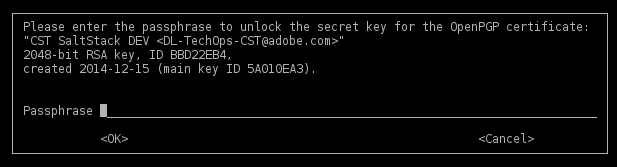

GPG Agent Requirements
======================

This section outlines the requirements for the ``gpg.conf`` and
``gpg-agent.conf``.

 - gpg.conf updated to use-agent
 - gpg-agent.conf updated to specify pinentry-program
 - gpg-agent.conf updated to specify extended cache-ttl

The GPG Agent
=============

In order to publish GPG encrypted secrets using a passphrase-enabled key you'll
need to run a GPG agent. This agent will allow you to authenticate once to the
encryption key and not require a passphrase be entered anytime someone requests
a key. This provides the added security of a passphrase on the encryption key,
but the usability of not requesting a passphrase on every request.

This step of the process requires an update to a configuration file as well as
manually unlocking the GPG key. I will again mention that this process is
currently manual and will need to be repeated anytime the system is restarted
and the GPG agent restarted.

There are a few settings that need to be defined in order for this to work
properly. The next two sections tell the system that you want to use an agent,
and how that agent should be used to prompt you for a passphrase.

It is important to note that the gpg-agent has a default cache ttl value. If
the key is not unlocked or requested within that cache time the passphrase will
be forgotten and you'll need to request it again.

I have solved this by increasing the default max-cache-ttl value to one day as
well as configured a salt scheduler to request a "cache" token from the secret
store on a regular interval. On each successful request the max-cache-ttl is
reset and the countdown starts over. The combination of a one-time unlocking
and regular queries for an encrypted value will allow the cache to remain
effective until the system or the services is restarted.

gpg.conf
--------

You need to tell the gpg utility that it should use the agent. This is done by
updating the ``gpg.conf`` file, which you'll likely need to create inside the
``/etc/salt/gpgkeys`` directory. This will tell any instance of ``gpg``
specifying this path as a ``--homedir`` that it should use a gpg-agent.

.. code-block:: diff

    + use-agent

gpg-agent.conf
--------------

In order for Salt to prompt you for the passphrase it needs to know how to do
so. This can be defined within the ``gpg-agent.conf`` file, which you'll likely
need to create inside the ``/etc/salt/gpgkeys`` directory. This file simply
holds configuration on how the agent should run. In our basic setup you'll only
need to add a single line to this new file. The example below shows a unified
diff of the file. Add the line(s) as defined by the + character, but do not add
the + character itself.

.. code-block:: diff

    + pinentry-program /usr/bin/pinentry-curses
    + default-cache-ttl 86400 # one day
    + max-cache-ttl 31536000  # one year

gpg-agent
---------

You'll need to manually launch the gpg-agent and then tell SaltStack where it
can find the running agent. This 

unlock the key
--------------

Once you've started the gpg-agent and provided SaltStack with the information
required to access this agent you're ready to unlock the keyring. All you
should need to do for this to happen is request a key from the Salt master.
Make sure that your pillar top file has been configured to allow the Salt
master access to a key (any key will do). Request this key using the command
below:

.. code-block:: salt

    salt-call pillar.item secret

When you run this command Salt will try to decipher the encrypted value stored
within your pillar data. Now that it knows about your gpg agent information
it'll request access through that socket. The first time it runs it'll
determine that no access has been granted and prompt you for a passphrase. You
should see a curses-based prompt appear in your terminal asking you for the
encryption password. Enter this password once and your key will be unlocked.
This should last for the duration of your session or your GPG max-cache-ttl.

